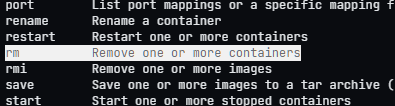

# Module 1 Homework
## Docker & SQL

### Question 1. Knowing docker tags

Which tag has the following text? - Automatically remove the container when it exits

- --delete

- --rc

- --rmc

- **--rm**



---

### Question 2. Understanding docker first run

Run docker with the python:3.9 image in an interactive mode and the entrypoint of bash. Now check the python modules that are installed ( use pip list ).

What is version of the package wheel ?

- **0.42.0**

- 1.0.0

- 23.0.1

- 58.1.0

``` bash
docker run -it --entrypoint bash python:3.9
```
``` bash
pip list
```
``` bash
Package    Version
---------- -------
pip        23.0.1
setuptools 58.1.0
wheel      0.42.0
```

---

## Question 3. Count records

How many taxi trips were totally made on September 18th 2019?

Tip: started and finished on 2019-09-18. 

Remember that `lpep_pickup_datetime` and `lpep_dropoff_datetime` columns are in the format timestamp (date and hour+min+sec) and not in date.

- 15767
- **15612**
- 15859
- 89009

Consider processing the data only from pandas
``` Python
Import pandas as pd
df = pd.read_csv('green_tripdata_2019-09.csv',low_memory=False)
```

``` Python
# Assuming df is your DataFrame with columns lpep_pickup_datetime and lpep_dropoff_datetime
df['pickup_date'] = pd.to_datetime(df['lpep_pickup_datetime']).dt.date
df['dropoff_date'] = pd.to_datetime(df['lpep_dropoff_datetime']).dt.date

# Filter the DataFrame for trips on September 18, 2019
trips_on_sep_18 = df[(df['pickup_date'] == pd.to_datetime('2019-09-18').date()) &
                     (df['dropoff_date'] == pd.to_datetime('2019-09-18').date())]

# Get the number of trips
number_of_trips = len(trips_on_sep_18)

print(f'The number of taxi trips on September 18, 2019, is: {number_of_trips}')

```
``` Output
The number of taxi trips on September 18, 2019, is: 15612
```

---

## Question 4. Largest trip for each day

Which was the pick up day with the largest trip distance
Use the pick up time for your calculations.

- 2019-09-18
- 2019-09-16
- **2019-09-26**
- 2019-09-21

``` Python
# Assuming df is your DataFrame with columns lpep_pickup_datetime, lpep_dropoff_datetime, and trip_distance
df['pickup_date'] = pd.to_datetime(df['lpep_pickup_datetime']).dt.date
df['dropoff_date'] = pd.to_datetime(df['lpep_dropoff_datetime']).dt.date

# Group by pick-up date and sum the trip distances
daily_trip_distances = df.groupby('pickup_date')['trip_distance'].sum()

# Find the pick-up day with the largest total trip distance
max_distance_day = daily_trip_distances.idxmax()
max_distance_value = daily_trip_distances.max()

print(f'The pick-up day with the largest total trip distance was {max_distance_day} with a total distance of {max_distance_value} miles.')
```

``` Output
The pick-up day with the largest total trip distance was 2019-09-26 with a total distance of 58759.94 miles.
```

---

## Question 5. Three biggest pick up Boroughs

Consider lpep_pickup_datetime in '2019-09-18' and ignoring Borough has Unknown

Which were the 3 pick up Boroughs that had a sum of total_amount superior to 50000?
 
- **"Brooklyn" "Manhattan" "Queens"**
- "Bronx" "Brooklyn" "Manhattan"
- "Bronx" "Manhattan" "Queens" 
- "Brooklyn" "Queens" "Staten Island"

``` Python

```
``` Output
```

---

## Question 6. Largest tip

For the passengers picked up in September 2019 in the zone name Astoria which was the drop off zone that had the largest tip?
We want the name of the zone, not the id.

Note: it's not a typo, it's `tip` , not `trip`

- Central Park
- Jamaica
- **JFK Airport**
- Long Island City/Queens Plaza

``` Python

```
``` Output

```

---

## Question 7. Creating Resources

After updating the main.tf and variable.tf files run:
```
terraform apply
```
``` bash
$ terraform apply

Terraform used the selected providers to generate the following execution plan. Resource actions are indicated with the following symbols:
  + create

Terraform will perform the following actions:

  # google_bigquery_dataset.demo_dataset will be created
  + resource "google_bigquery_dataset" "zoomcamp-2024-dw" {
      + creation_time              = (known after apply)
      + dataset_id                 = "zoomcamp-2024-dw"
      + default_collation          = (known after apply)
      + delete_contents_on_destroy = false
      + effective_labels           = (known after apply)
      + etag                       = (known after apply)
      + id                         = (known after apply)
      + is_case_insensitive        = (known after apply)
      + last_modified_time         = (known after apply)
      + location                   = "US"
      + max_time_travel_hours      = (known after apply)
      + project                    = "Yogi-Zoomcamp-2024"
      + self_link                  = (known after apply)
      + storage_billing_model      = (known after apply)
      + terraform_labels           = (known after apply)
    }

  # google_storage_bucket.demo-bucket will be created
  + resource "google_storage_bucket" "zoomcamp-2024-lake" {
      + effective_labels            = (known after apply)
      + force_destroy               = true
      + id                          = (known after apply)
      + location                    = "US"
      + name                        = "Yogi-Zoomcamp-2024"
      + project                     = (known after apply)
      + public_access_prevention    = (known after apply)
      + self_link                   = (known after apply)
      + storage_class               = "STANDARD"
      + terraform_labels            = (known after apply)
      + uniform_bucket_level_access = (known after apply)
      + url                         = (known after apply)

      + lifecycle_rule {
          + action {
              + type = "AbortIncompleteMultipartUpload"
            }
          + condition {
              + age                   = 1
              + matches_prefix        = []
              + matches_storage_class = []
              + matches_suffix        = []
              + with_state            = (known after apply)
            }
        }
    }

Plan: 2 to add, 0 to change, 0 to destroy.

Do you want to perform these actions?
  Terraform will perform the actions described above.
  Only 'yes' will be accepted to approve.

  Enter a value: yes

google_bigquery_dataset.demo_dataset: Creating...
google_storage_bucket.demo-bucket: Creating...
google_storage_bucket.demo-bucket: Creation complete after 2s [id=Yogi-Zoomcamp-2024]
google_bigquery_dataset.demo_dataset: Creation complete after 3s [id=projects/Yogi-Zoomcamp-2024/datasets/Zoomcamp-2024-dw]

Apply complete! Resources: 2 added, 0 changed, 0 destroyed.
```

Paste the output of this command into the homework submission form.